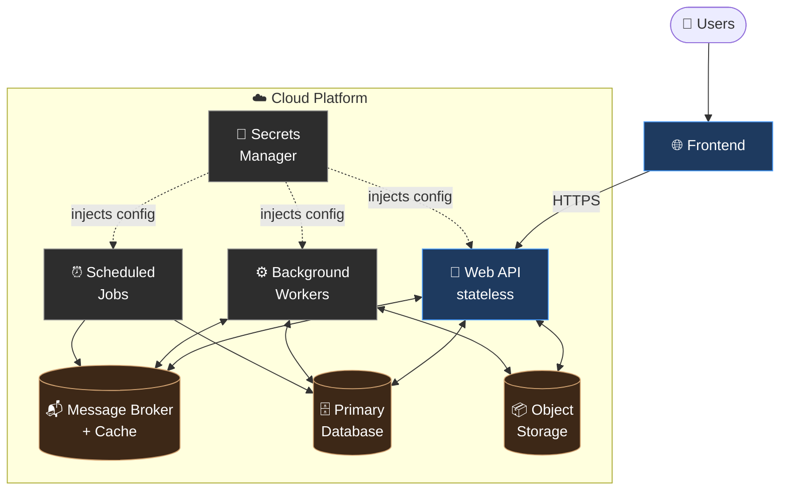
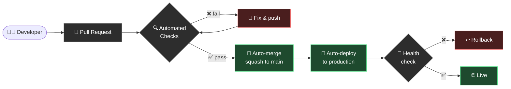

# H1B Jobs List — Public Overview

🔗 **Live site:** [h1bjobslist.com](https://h1bjobslist.com)

> This document is a high-level, public-facing overview of the H1B Jobs List platform. It intentionally omits internal implementation details, infrastructure specifics, and operational procedures. For partnership, security, or technical inquiries, please contact the maintainers.

---

## What is H1B Jobs List?

H1B Jobs List is a job discovery platform that helps candidates find roles at organizations likely to support visa sponsorship. We aggregate, classify, and rank job opportunities so users can focus their search on employers that match their needs.

---

## Architecture Overview

The system is built as a small set of cooperating services deployed to the cloud. Each component has a single, well-defined responsibility, and components communicate through well-understood interfaces.

### High-level components

- **Web API** — A stateless HTTP service that handles user requests: authentication, browsing jobs, managing profiles, and retrieving reports. This is the only component exposed to the public internet.
- **Background Workers** — Asynchronous workers that handle longer-running tasks offloaded from the API, keeping user-facing requests fast and responsive.
- **Scheduled Jobs** — Periodic tasks that refresh the underlying dataset on a recurring cadence.
- **Message Broker / Cache** — An in-memory data store that coordinates work between services and provides ephemeral caching.
- **Primary Database** — A managed relational database that serves as the system of record.
- **Object Storage** — Durable storage for user-generated files and generated artifacts.

### Visual diagram

### Design principles

- **Separation of concerns** — User-facing requests, background processing, and scheduled work each run in isolated services so one can scale or fail independently.
- **Stateless services** — Application services hold no local state; all persistent data lives in managed datastores.
- **Secrets management** — All credentials and configuration are injected at runtime from a dedicated secrets manager; nothing sensitive lives in the repository or container images.
- **Infrastructure as code** — Environments are reproducible and version-controlled.

---

## Continuous Integration & Deployment

We practice trunk-based development with a fully automated CI/CD pipeline. During active development we routinely merge and deploy **20+ pull requests per day**, with every change flowing from commit to production without manual intervention.

### Pipeline flow

### Every pull request is automatically gated on

- **Static analysis** — linting and formatting checks
- **Type checking** — full static type verification
- **Automated test suite** — unit and integration tests
- **Container build verification** — the production container image must build cleanly
- **Deployment health check** — the target environment must report a successful deploy

PRs that pass all checks are auto-merged into `main` via squash merge, after which the production environment redeploys automatically. Branch protection enforces linear history, required reviews, and green checks — no exceptions, no manual overrides. Preview environments are spun up per-PR so changes can be validated in isolation before landing.

This pipeline lets a small team ship safely at high velocity: the median change reaches production within minutes of approval.

---

## Data Privacy & Compliance

We take the privacy of our users seriously and are committed to compliance with applicable data protection regulations, including the **EU General Data Protection Regulation (GDPR)** and the **California Consumer Privacy Act (CCPA)**.

### User rights we support

- **Right to access** — Users can request a copy of the personal data we hold about them.
- **Right to erasure ("right to be forgotten")** — Users can request deletion of their account and all associated personal data. Deletion is automated end-to-end and cascades across our primary datastore and object storage.
- **Right to rectification** — Users can update or correct their personal information at any time through their account.
- **Right to data portability** — Users can export their data in a portable, machine-readable format.
- **Right to opt-out** — California residents can opt out of the sale or sharing of personal information (we do not sell personal data).

### Operational safeguards

- **Data minimization** — We collect only the personal data necessary to deliver the service.
- **Retention limits** — Personal data tied to inactive accounts is purged on a defined schedule. Financial records are retained only as long as required by applicable tax law.
- **Audit logging** — Access to personal data is logged for accountability and compliance review, with audit records kept consistent with deletion requests.
- **Encryption** — Data is encrypted in transit and at rest using industry-standard protocols.
- **Least-privilege access** — Production data access is restricted, scoped, and auditable.

To exercise any of the above rights, or for questions about how your data is handled, please contact the maintainers.

---

## Tech Stack (general)

Python-based services, containerized and deployed to a managed cloud platform, with CI/CD gating every change on automated tests, type checks, and linting before release. The frontend is hosted on a global edge network for low-latency delivery worldwide.

---

🔗 **Live site:** [h1bjobslist.com](https://h1bjobslist.com)

*For implementation details, deployment procedures, or internal architecture, please contact the maintainers.*
